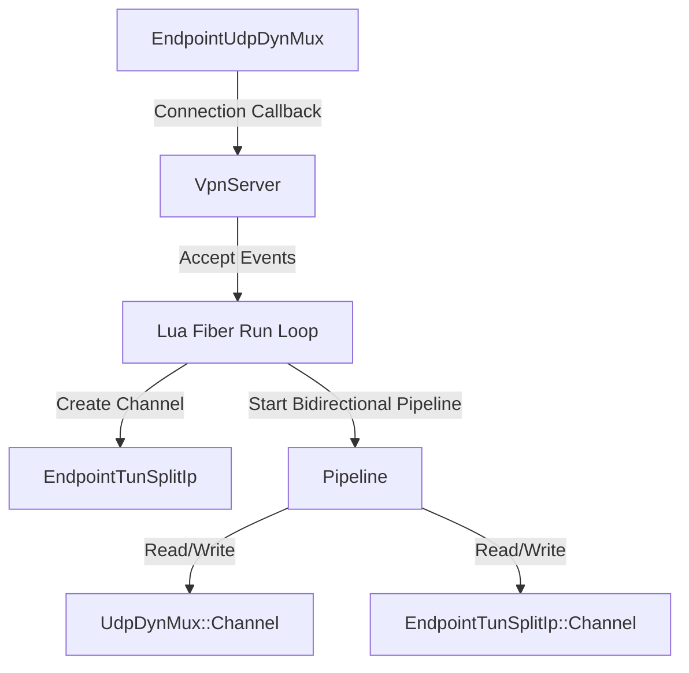

# VPN Server Architecture Design

This document details the design of the C++ `VpnServer` component in the `great-hole-application` library and how it integrates with `UdpDynMux`, `EndpointTunSplitIp`, and the Lua bindings.

## Overview

The VPN Server manages incoming client connection sessions. A client connects by negotiating a channel over `EndpointUdpDynMux`. Upon successful negotiation, a tunnel interface channel on `EndpointTunSplitIp` is created, and a bidirectional packet routing pipeline is set up to connect the two endpoints. When the client disconnects or times out, the pipeline and split IP channel are stopped and cleaned up.



## Key Components

### 1. Symmetrical Channel Notification in `UdpDynMux`

We extend `UdpDynMux::ChannelNotification` with `OnChannelClosed` to notify when a negotiated channel leaves the running state:

```cpp
class ChannelNotification {
public:
  virtual ~ChannelNotification() = default;
  virtual Omni::Fiber::Coroutine<void> OnChannelEstablished(std::shared_ptr<UdpDynMux::Channel> channel) = 0;
  virtual Omni::Fiber::Coroutine<void> OnChannelClosed(std::shared_ptr<UdpDynMux::Channel> channel) = 0;
};
```

Within `UdpDynMux::Channel::DoWork()`, transitions into and out of `State::kRunning` will fire the respective notification.

### 2. `EndpointTunSplitIp::RemoveChannel` by Pointer

To simplify channel deletion in Lua and C++, we introduce a new overload for `RemoveChannel` in `EndpointTunSplitIp` that takes a channel pointer instead of a single IP address:

```cpp
Omni::Fiber::Coroutine<void> RemoveChannel(std::shared_ptr<Channel> channel);
```

This overload retrieves the associated list of IP addresses from `channel->GetIps()` and cleans them up from the internal lookup map, before stopping the channel service.

### 3. `VpnServer` Component

`VpnServer` acts as the coordinator. It implements `UdpDynMux::ChannelNotification`, collects connection events, and exposes an event processing loop that runs within the Lua fiber context.

#### Public API

```cpp
namespace gh {

class VpnServer : public ServiceBase, public UdpDynMux::ChannelNotification {
public:
  explicit VpnServer(std::shared_ptr<EndpointTunSplitIp> tunSplit);
  ~VpnServer() override;

  std::string GetName() const override;

  void RegisterPeer(const UdpDynMux::PskType& psk, const std::vector<boost::asio::ip::address_v6>& ips);
  void UnregisterPeer(const UdpDynMux::PskType& psk);

  // Connection callbacks
  Omni::Fiber::Coroutine<void> OnChannelEstablished(std::shared_ptr<UdpDynMux::Channel> channel) override;
  Omni::Fiber::Coroutine<void> OnChannelClosed(std::shared_ptr<UdpDynMux::Channel> channel) override;

protected:
  Omni::Fiber::Coroutine<ErrorCode> DoStart() override;
  Omni::Fiber::Coroutine<void> DoWork() override;
  Omni::Fiber::Coroutine<ErrorCode> DoGracefulStop() override;

private:
  struct Session {
    std::shared_ptr<EndpointTunSplitIp::Channel> TunChannel;
    std::shared_ptr<Pipeline> Pipeline;
  };

  std::shared_ptr<EndpointTunSplitIp> _TunSplit;
  std::map<UdpDynMux::PskType, std::vector<boost::asio::ip::address_v6>> _Peers;
  std::map<std::shared_ptr<UdpDynMux::Channel>, Session> _Sessions;
  Omni::Fiber::RemoteCall _ChannelCall;
};

} // namespace gh
```

## Lua Integration Flow

1. Define a Lua `vpn_server` userdata wrapped around `std::shared_ptr<VpnServer>`.
2. Register peers via `vpn_server:register_peer(psk, {ip1, ip2, ...})`.
3. Start the service via `vpn_server:start()`, which starts the background fiber.
4. When executing, connection/disconnection events will trigger dynamic allocation/deallocation of pipelines and tun-split channels entirely in C++.
5. Stop the service via `vpn_server:stop()`.
