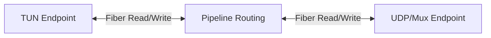

# GreatHole Core Module Internal Design (`great-hole-core`)

This document describes the internal architecture, template design patterns, concurrency choices, and data flow of the `core` module.

---

## 1. PacketBuilder Design & Metaprogramming

`PacketBuilder.hpp` is a header-only library enabling zero-copy, compile-time offset computation and validation of packet headers using modern C++23 features.

### Class Layout
- **`PacketComponentContainer`**:
  - Encapsulates a layout of fields and points to the next chained component.
  - Form: `template <typename FieldsTuple, typename NextComponent> class PacketComponentContainer;`
  - Specialization: `template <typename... Fields, typename NextComponent> class PacketComponentContainer<std::tuple<Fields...>, NextComponent>`
  - Offset calculation is computed at compile-time via `consteval` lambdas using folded pack expansions and index sequences:
    ```cpp
    static constexpr const std::array<FieldInfo, sizeof...(Fields)> FieldOffsets = []() consteval {
      std::array<FieldInfo, sizeof...(Fields)> result{};
      auto process = [&]<std::size_t Is, typename Field>() {
        result[Is].Size = Field::Size;
        if constexpr (Is == 0) result[Is].Offset = 0;
        else result[Is].Offset = result[Is - 1].Offset + result[Is - 1].Size;
      };
      // ... Index sequence expansion ...
    }();
    ```

### PacketBuilder & Parser Flow
- **`PacketBuilder`**: Employs a fluent builder API where invoking `operator()` processes fields, sets the data in a zero-copy `std::span`, and returns a builder pointing to the next component:
  ```
  PacketBuilder<ComponentA> -> operator() -> PacketBuilder<ComponentB>
  ```
- **`PacketParser`**: Provides a type-safe `Get<Field>()` helper that calculates the index of `Field` inside `FieldsTuple` at compile time and reads the underlying memory with proper endian conversion.
- **Branching Component Parsing (`PacketComponentEnumMap`)**:
  - Dynamically branched packet headers use `PacketComponentEnumMap` which matches the parsed enum value at runtime to corresponding `PacketComponentEnumMapEntry` types.
  - `PacketParser::operator()` delegates to `NextParserCaller`, which implements overloaded `operator()` methods disambiguated by template constraints (`requires (!std::same_as<NextComponent, PacketComponentEnd>)` and `requires std::same_as<ComponentEnd, PacketComponentEnd>`) to handle intermediate components, final targets, and early void exits.

---

## 2. Pipeline and Concurrency Model

GreatHole uses fibers for lightweight concurrency, defined in the `omni-fiber` library.



- **Thread-Safety**: Endpoints execute reading and writing concurrently using dedicated reader/writer fibers. Zero-copy transfer is preferred via `std::span<uint8_t>`.
- **Lifecycles**: `Pipeline::Start` spawns read/write loops running in `omni-fiber` fibers. Stopping the pipeline cancels pending IO operations gracefully.

---

## 3. Dynamic UDP Multiplexing (`EndpointUdpDynMux`)

`EndpointUdpDynMux` implements dynamic channel multiplexing on a single UDP port.
- State machines are managed via asynchronous keepalives, version negotiation, and re-keying/address migration.
- For detailed bitwise layouts, refer to [EndpointUdpDynMuxProtocol.md](file:///home/kghost/workspace/great-hole/src/core/EndpointUdpDynMuxProtocol.md).

### Renegotiation & State Transitions
- **`INVALID_CHANNEL` Reset**: If a running channel receives an `INVALID_CHANNEL` message from its peer, it resets its state to `State::kNegotiating` and clears its remote channel ID.
- **Write Verification**: When writing data packets to a channel, the channel verifies that its internal state is `State::kRunning`. Otherwise, it returns `kInvalidPacketSession`.
- **Negotiation Race Prevention**: During renegotiation (e.g., when a endpoint restarts and binds to the same port), the initiator sends `INITIATE` and waits for a response. The responder receives the message, sends its own `INITIATE` back, and transitions to `State::kRunning`. However, because sending is asynchronous, the initiator might reach `State::kRunning` first while the responder is still finishing its send coroutine and hasn't yet entered `State::kRunning`. Any data packet sent by the initiator at this exact instant will be received by the responder while it is still in `State::kNegotiating`, causing the packet to be rejected as `INVALID_CHANNEL`.
  - *Fix for Tests*: Unit tests verifying renegotiation must wait until **both** endpoints have fully transitioned to `State::kRunning` before attempting to transmit data.
