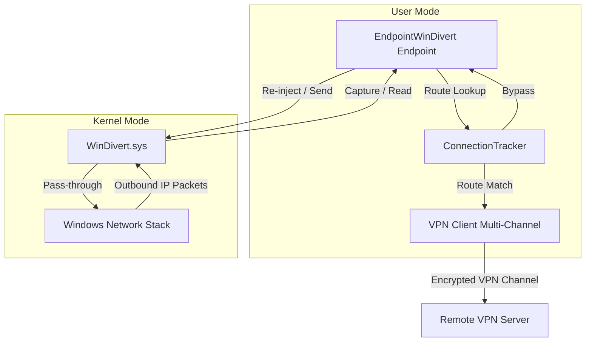

# Design Document: Windows Network Redirection (WinDivert)

This document details the internal design and implementation of the Windows packet capture and redirection layer.

## Architecture Overview

On Windows, virtual TUN/TAP network adapters are complex to install and require administrative installations. Instead of using virtual adapters, the Windows redirection component of `great-hole-core` utilizes the user-mode packet capture framework **WinDivert** to intercept and inject network traffic directly from the kernel network stack.



## Internal Component Design

### `gh::EndpointWinDivert`

The primary class [EndpointWinDivert](file:///q:/Projects/great-hole/src/core/windows/EndpointWinDivert.hpp) implements the virtual `gh::Endpoint` interfaces.

#### Packet Redirection Filter
When starting (`DoStart`), `EndpointWinDivert` requests packet capture via the WinDivert filter:
```
outbound and !impostor and ip and !loopback
```
- `outbound`: Intercepts packets originating from the host machine that are sent to external networks.
- `!impostor`: Excludes packets that were already injected or generated by WinDivert itself to avoid infinite capture/processing loops.
- `ip`: Captures IPv4 and IPv6 traffic.
- `!loopback`: Excludes local loopback traffic (localhost).

#### Asynchronous I/O Integration
Since Windows `HANDLE` objects returned by WinDivert are waitable asynchronous resources, we integrate them with `Boost.Asio` using `boost::asio::windows::object_handle`:
- **Read Operations**: Intercepted using overlapping structures (`OVERLAPPED`) and waitable event handles. When a packet is captured, `WinDivertRecvEx` initiates the capture.
- **Write Operations**: Packets returning from the VPN channel are injected back into the Windows kernel via `WinDivertSendEx` with the appropriate interface index (`IfIdx` and `SubIfIdx`) cached from previous outgoing packets to ensure correct routing.

#### Connection Tracking & Loop Prevention
Each captured packet is evaluated through the `ConnectionTracker`:
- If `RouteResult` is `Bypass`: The packet is immediately re-injected into the network stack via `WinDivertSend` to continue its normal path.
- If `RouteResult` is `Discard`: The packet is dropped in user space.
- Otherwise (routed via chosen VPN session): The packet is forwarded up through the VPN client pipeline to be transmitted to the remote server.
