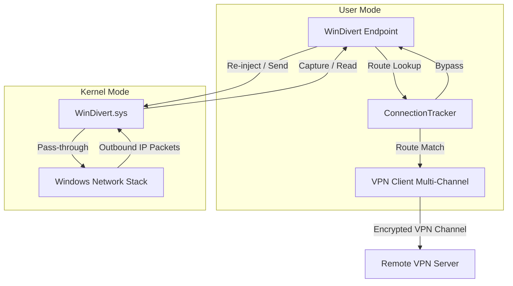

# Design Document: Windows Network Redirection (WinDivert)

This document details the internal design and implementation of the Windows packet capture and redirection layer.

## Architecture Overview

On Windows, virtual TUN/TAP network adapters are complex to install and require administrative installations. Instead of using virtual adapters, the Windows redirection component of `great-hole-core` utilizes the user-mode packet capture framework **WinDivert** to intercept and inject network traffic directly from the kernel network stack.



## Internal Component Design

### `gh::WinDivert`

The primary class [WinDivert](src/core/windows/WinDivert.hpp) implements the virtual `gh::Endpoint` interfaces.

#### Packet Redirection Filter
When starting (`DoStart`), `WinDivert` requests packet capture via the WinDivert filter:
```
outbound and !impostor and ip and !loopback
```
- `outbound`: Intercepts packets originating from the host machine that are sent to external networks.
- `!impostor`: Excludes packets that were already injected or generated by WinDivert itself to avoid infinite capture/processing loops.
- `ip`: Captures IPv4 and IPv6 traffic.
- `!loopback`: Excludes local loopback traffic (localhost).

#### Asynchronous I/O Integration
Since Windows `HANDLE` objects returned by WinDivert are waitable asynchronous resources, we integrate them with `Boost.Asio` using `boost::asio::windows::object_handle`:
- **Read Operations**: Intercepted using overlapping structures (`OVERLAPPED`) and waitable event handles. When a packet is captured, `WinDivertRecvEx` initiates the capture. If the packet matches the bypass rules determined by the queried `WinDivertRouteCallback`, it is synchronously re-injected back to its original path using `WinDivertSendEx`, and the read loop continues to capture the next packet.
- **Write Operations**: Packets returning from the VPN channel are injected back into the Windows kernel via `WinDivertSendEx` with the appropriate interface index (`IfIdx` and `SubIfIdx`) cached from previous outgoing packets to ensure correct routing.
- **Cancellation**: Since `boost::asio::windows::object_handle` does not natively support Asio cancellation slots, we associate the WinDivert handle and the active `OVERLAPPED` structure with the `Cancel` token via `Cancel::HandleTracker`. Triggering the cancel token calls `CancelIoEx` on the specific overlapped block, signaling the waitable event and waking up the pending `async_wait` with `operation_aborted`.

#### Connection Tracking & Loop Prevention
Each captured packet that is not bypassed by the fast bypass callback is evaluated through the `ConnectionTracker`:
- If `RouteResult` is `Bypass`: The packet is immediately re-injected into the network stack via `WinDivertSend` to continue its normal path.
- If `RouteResult` is `Discard`: The packet is dropped in user space.
- Otherwise (routed via chosen VPN session): The packet is forwarded up through the VPN client pipeline to be transmitted to the remote server.

## Unit Testing Fake WinDivert DLL

To enable unit testing of the WinDivert data plane components without requiring administrative permissions or the actual `WinDivert.sys` kernel driver, this module implements a fake `WinDivert.dll` located under `tests/`.

### Design & Architecture

The fake DLL mimics the exact binary interface of the official WinDivert library by exporting identical entry points:
- `WinDivertOpen`
- `WinDivertClose`
- `WinDivertRecvEx`
- `WinDivertSendEx`
- `WinDivertHelperHtonIPv6Address`
- `GetFakeWinDivertControllerPtr`

#### Asynchronous I/O Simulation (Named Pipes)
To faithfully simulate asynchronous overlapped I/O:
1. `WinDivertOpen` creates a local duplex Named Pipe pair (`pipeServer` and `pipeClient`) with a unique name matching the current process and an atomic counter. It returns the `pipeClient` handle to the application.
2. `WinDivertRecvEx` performs an overlapped `ReadFile` on the `pipeClient` handle.
3. If no packets are available, the OS puts the read into `ERROR_IO_PENDING` state and waits on the overlapped event (`overlapped.hEvent`).
4. To inject/receive a packet during a test, the `FakeWinDivertController` writes the packet data to `pipeServer`. The Windows named pipe driver completes the pending read, populating the user buffer, and sets the event.
5. If the application calls `CancelIoEx`, the Windows named pipe driver automatically cancels the pending `ReadFile` and completes the overlapped operation with `STATUS_CANCELLED` immediately.

#### Address Mocking & Correlation
Since standard Windows Named Pipes only carry raw stream data, the `FakeWinDivertController` maintains a thread-safe registry mapping `LPOVERLAPPED` pointers to the application's target `WINDIVERT_ADDRESS` pointers.
- **Asynchronous Reads**: When a read is pending, the controller copies the test address to the application's `WINDIVERT_ADDRESS` buffer *before* writing the packet data to the server pipe. When the read completes, the application sees the populated address.
- **Synchronous Reads**: If data is written while no read is pending, the address is buffered in a FIFO queue. When `WinDivertRecvEx` is called later, it pops the address synchronously alongside the `ReadFile`.
- **Cancellation**: Non-pending / cancelled operations are pruned from the tracking registry by inspecting `overlapped->Internal != STATUS_PENDING` (`0x103`).
