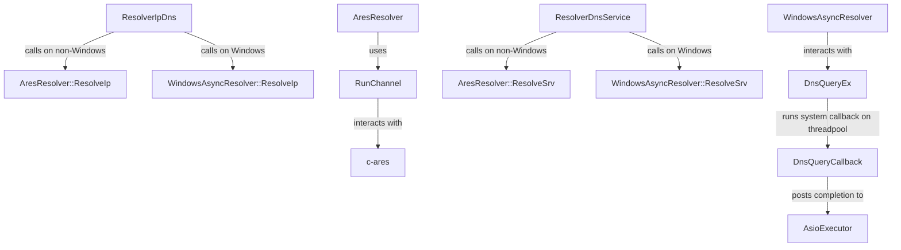

# Resolvers Design Details

This document outlines the internal implementation details of the `resolvers` module, with a focus on the `AresResolver` integration.

## AresResolver and WindowsAsyncResolver Integration

The GreatHole project utilizes different non-blocking resolver implementations depending on the platform:
- On non-Windows platforms (e.g., Linux, Android), it uses the **`c-ares`** library via the `AresResolver` class.
- On Windows platforms, it uses native **`DnsQueryEx`** APIs via the `WindowsAsyncResolver` class to align with native Windows DNS cache/policy and support hybrid network interfaces.

### Architecture

### AresResolver Channel Execution Flow (`RunChannel`)

`RunChannel` is the core driver loop for `c-ares` async lookups:
1. It initializes an asynchronous `c-ares` channel with socket state callbacks (`OnSocketStateChange`).
2. When `c-ares` creates or modifies sockets, `OnSocketStateChange` adds or updates `SocketTracker` descriptors.
3. The event loop waits asynchronously on the active socket descriptors using Boost.Asio (`async_wait` for read/write events) and a steady timer for DNS timeouts.
4. Active socket operations or timeouts wake up the calling fiber via `Omni::Fiber::Select`.
5. Upon completion or cancellation, `ares_destroy` clean up the channel.

### WindowsAsyncResolver Execution Flow (`DnsQueryEx`)

`WindowsAsyncResolver` leverages Windows native `DnsQueryEx` for high performance name resolution:
1. **Parallel Lookup**: For IP resolution (`ResolveIp`), both `A` and `AAAA` queries are issued in parallel via `DnsQueryEx` to support dual-stack resolution.
2. **Context Ownership**: A heap-allocated state context (`std::shared_ptr<IpQueryState>` or `std::shared_ptr<SrvQueryState>`) tracks in-flight queries. A raw pointer copy of this state is passed to the C-style callback as `pQueryContext` to keep the context alive even if the calling fiber terminates or cancels the request.
3. **Asynchronous Callbacks**: Windows invokes the `QueryCompleteCallback` on a system threadpool thread once the lookup concludes.
4. **ASIO Integration**: The system callback marshals the results and posts them back into the `boost::asio::io_context` executor via `boost::asio::post`.
5. **Fiber Resumption**: Once the posted task executes in the executor thread, it triggers an `Omni::Fiber::Event` which wakes the suspended resolver fiber.
6. **Cancellation**: If cancelled, `DnsCancelQuery` is called to abort the pending native query. The callback context is freed safely when Windows calls the completion callback later.

### Cancellation Support

Both `AresResolver::ResolveIp` and `AresResolver::ResolveSrv` accept a `Cancel& cancel` object. If triggered:
- The execution loop cancels all outstanding Asio socket wait operations.
- The `RunChannel` function terminates early, returning `operation_aborted`.

### Windows DNS Auto-Discovery Fallback

In Windows environments, `c-ares`' built-in DNS server discovery (which reads from legacy Windows registry parameters) often fails to retrieve name servers in dual-stack/hybrid network configurations, falling back to localhost (`127.0.0.1:53`).

To resolve this efficiently without per-request overhead:
- During global library initialization (`AresGlobal` constructor), the library checks if the `ARES_SERVERS` environment variable is already set.
- If not set, it queries active network interfaces dynamically using the Windows native **`GetAdaptersAddresses`** API.
- All discovered IPv4 and IPv6 DNS server addresses are formatted and set globally by exporting `ARES_SERVERS` into the process environment.
- Deprecated IPv6 site-local DNS servers (within the `fec0::/10` prefix, wait, in code `fec0::/16`), which are commonly returned by Windows as dummy defaults when no actual IPv6 DNS is configured, are filtered out.
- Loopback DNS server addresses (e.g. `127.0.0.0/8` and `::1`) are also filtered out to prevent queries from looping back locally.
- Discovered IPv6 addresses are exported *without* square brackets (`[...]`) because `c-ares` expects square brackets *only* when a port is explicitly appended (e.g. `[ipv6]:port`), and brackets without a port cause parser errors.
- If the discovered DNS server list is empty (or all servers are filtered out), public fallback DNS servers (`8.8.8.8,1.1.1.1`) are assigned to prevent `c-ares` from defaulting to `127.0.0.1`.
- Subsequent `c-ares` channels automatically read this environment variable upon creation.
- To support this on Windows builds, the target links with the Windows system library `iphlpapi`.

