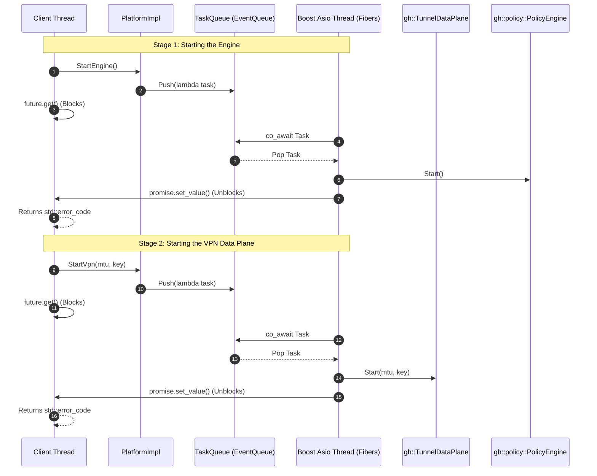

# GreatHole Windows Platform Interface - Internal Design

This document details the internal design, architecture, thread boundaries, and event queue marshaling of the **GreatHole Windows Platform Interface**.

---

## 1. System Architecture & Threading Model

The GreatHole Windows platform module coordinates interactions between the public platform interface and the underlying async components:
- **Client Application Thread (Caller)**: Invokes the synchronous control methods of `PlatformInterface` (e.g. `StartEngine`, `StartVpn`, `StopEngine`, `StopVpn`, `AddEndpoint`).
- **C++ Backend (Boost.Asio)**: Intercepts packets, tracks connections, routes VPN packets, and listens for ETW process events. Execution runs sequentially on a single-threaded Boost.Asio event loop to achieve lock-free safety for trackers.

To prevent race conditions, deadlocks, and thread safety violations on core C++ structures, **all platform operations that modify backend state must be executed on the Boost.Asio executor thread.**

To bridge these threads, `PlatformImpl` uses a queue-based marshaling model:
1. The calling thread creates a `std::promise` and gets its `std::future`.
2. A task containing the async operation is pushed onto the thread-safe `Omni::Fiber::EventQueue`.
3. The calling thread blocks by calling `future.get()` (or `future.wait()` in the destructor).
4. The Boost.Asio thread pops the task and runs it as a fiber coroutine. When completed, it sets the promise's value or exception.
5. The calling thread unblocks and returns the result (or throws the exception).

---

## 2. Interface and Class Structure

### 2.1. `PlatformInterface`
Located in `src/interface/Interface.hpp`, this is a pure virtual C++ interface. It keeps the public boundary clean and independent of platform-specific structures or headers.

### 2.2. `PlatformImpl`
Located in `src/windows/Interface.cpp`, this is the concrete Windows implementation. It inherits from `gh::Interface::PlatformInterface` and `gh::DeferredPacketInjector`.
- It implements the virtual interface functions.
- It implements `gh::DeferredPacketInjector::Inject` to allow packet injection back into the data plane.
- It instantiates and owns the `boost::asio::io_context` and runs the dedicated Asio runner thread.
